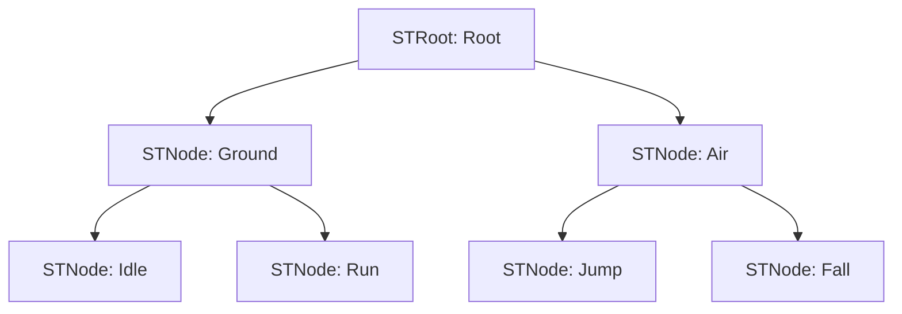

# Starlight State Tree 🌟

A lightweight, C#-based State Tree plugin for Godot 4.

Starlight State Tree allows you to organize game logic into a tree of nodes, where each node represents a state. It handles state entry/exit logic, active state updates, and transitions automatically.
This tree structure lets you extract duplicated code into parent nodes and focus on specific logic in children nodes.

Note that it is unable to create nested subtrees now.

## Installation

1. Download the plugin from Godot's AssetLib or download the release from this repo.
2. If you're downloading the release, put the folder `addons/starlight_state_tree` under `res://addons/`. If your project doesn't have the `addons` folder, create it or put entire `addons` folder from the zip file into your project.
3. Enable the plugin from `Project -> Project Settings -> Plugins`.
4. If it is unable to enable, here is the solution:
In `Project -> Project Settings -> Plugins`, click the pen icon on the right side of the plugin, then change Language to C#.
After that, go to `Project -> Project Settings -> Tools -> C#`, click "Create C# solution".
Finally, build your project and reload project. The plugin should be able to be activated now.

## Quick Start

### 1. Setup the Root
add a `STRoot` node to your scene. This acts as the manager for your state machine.

- **Initial State**: In the Inspector, set the `Initial State` property to the *name* of the state you want to start with. Note that all name references are based on node name in the scene. Currently duplicate state name is not allowed.
- **Allow Repeated Enter/Exit**: If checked, transitioning to a self/parent/child state will re-trigger the Enter/Exit logic for shared states in the path. If unchecked (default), shared parents will not be re-entered.

### 2. Create States
Add `STNode` nodes as children of the `STRoot`. You can nest `STNode`s inside other `STNode`s to create a hierarchy.

For example, we have a state tree setup like this:


Create a new idle state script inheriting from `STNode` for specific logic:

```csharp
using Godot;
using StarlightStateTree;

public partial class IdleState : STNode
{
    // Called when the state becomes active
    protected override void OnEnter()
    {
        GD.Print("Idle State Entered");
        // Example: Play an animation
        // GetNode<AnimationPlayer>("%AnimationPlayer").Play("Idle");
    }

    // Called every frame (equivalent to _Process)
    protected override void OnFrameUpdate(double delta)
    {
        if (Input.IsActionJustPressed("jump"))
        {
            // Request a transition by State Name (Node Name)
            // The name should be the same as that in your scene.
            RequestTransition("Jump");
        }
    }

    // Called every physics frame (equivalent to _PhysicsProcess)
    protected override void OnPhysicsUpdate(double delta)
    {
        // Physics logic here
    }

    // Called when the state becomes inactive
    protected override void OnExit()
    {
        GD.Print("Idle State Exited");
    }
}
```

To switch states, call `RequestTransition("TargetStateName")` from within any `STNode`.

The system finds the common ancestor between the current state and the target state. If `AllowRepeatedEnterAndExit` is `true`, the common ancestor is always `STRoot`.

It calls `OnExit()` on the old branch towards the ancestor.

It calls `OnEnter()` on the new branch away from the ancestor.

In this scenario, when `RequestTransition("Jump")` is called inside `IdleState`, the execution flow is like:

`Idle.OnExit() -> Ground.OnExit() -> Air.OnEnter() -> Jump.OnEnter()`

When `RequestTransition("Run")` is called inside `IdleState`, the execution flow is like:

`Idle.OnExit() -> Run.OnEnter()`

Furthermore, if `AllowRepeatedEnterAndExit` is `true`(`false` by default), then the flow is:

`Idle.OnExit() -> Ground.OnExit() -> Ground.OnEnter() -> Run.OnEnter()`

## API Reference
### STRoot (Inherits STNode)
The entry point of the state machine.

`CurrentState`: The active STNode that: has the greatest distance from STRoot, or is at the tail of the active chain.

`AllowRepeatedEnterAndExit`: Bool that configures transition behavior for common ancestors.

### STNode (Inherits Node)
The base class for all states.

`OnEnter()`: Override to handle logic when state becomes active.

`OnExit()`: Override to handle cleanup when state becomes inactive.

`OnFrameUpdate(double delta)`: Runs every frame only if the state is active.

`OnPhysicsUpdate(double delta)`: Runs every physics frame only if the state is active.

`OnReady()`: Override to handle logic when state is ready.

`OnEnterTree()`: Override to handle logic when this state node enters Scene Tree.

`RequestTransition(string targetStateName)`: Signals the root to change the state.

`ParentState`: Reference to the parent `STNode`.

`PreviousState`: Reference to the `STNode` that: had the greatest distance from `STRoot` before, or was at the tail of the previous active chain.
